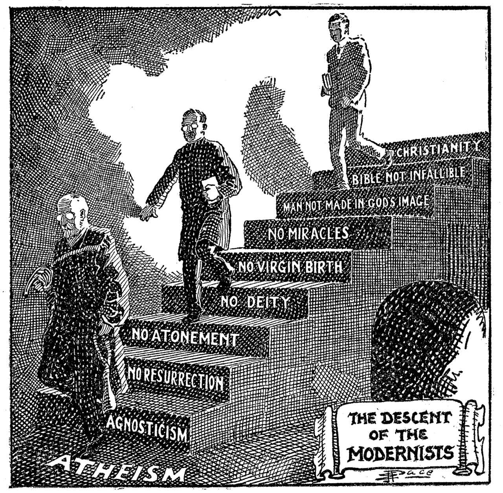

---
tags:
  - religion
  - philosophy
  - science
  - faith
  - reason
  - Inbox
Status: Seedlings
Related: 
owner: Tanzeel159
repo: Digital-Garden-content
attachment: true
dataview: true
share: true
date created: 2024-02-08 11:54:11
date modified: 2024-03-24 11:01:15
---
## Notes
- Imagine you have a set of rules or instructions that you think are really important and can't be changed. You believe that these rules should be followed exactly as they are without any changes. That's what fundamentalism is.
- It's a very strict way of thinking and following certain beliefs or ideas completely opposite to [Philosophy](./Philosophy.md#) where philosophers engage in critical thinking, reasoned enquiry to understand fundamental beliefs.
- People who are fundamentalists believe that their beliefs are the only right way, and they don't accept any other ideas or opinions.
- Fundamentalism in extreme cases can be linked to [intolerance](intolerance.md), [extremism](extremism.md), imposing beliefs on others. 
- 
- modernists advocated conscious adoption of christian faith in response to scientific discoveries.

---
## Related

1) [Philosophy](./Philosophy.md#)

---
## References

1) [Fundamentalist–modernist controversy - Wikipedia](https://en.wikipedia.org/wiki/Fundamentalist%E2%80%93modernist_controversy)
